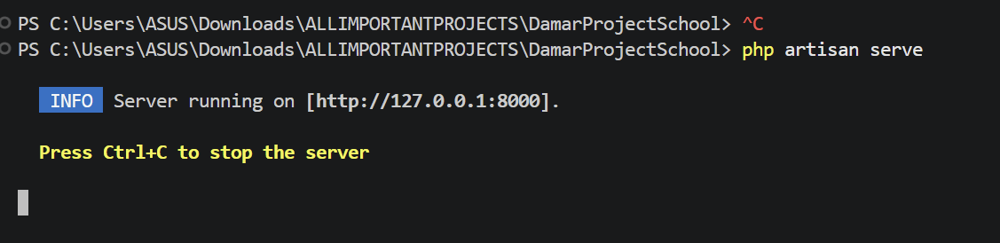

# Damar Project School

Portal sekolah berbasis Laravel untuk admin, guru, dan wali murid, lengkap dengan landing page profil sekolah, dashboard per role, manajemen data akademik, dan sistem rekomendasi sekolah lanjutan berbasis SAW.

## Clone And Run

### 1. How to start project

Setelag buka VSCODE,
Pertama-tama kamu harus tekan tombol ( Ctrl + ` ), simbol itu ada disebelah kiri angka 1, atau simplenya buka saja terminal VSCODE
Bebas mau powershell atau cmd
Lalu jalankan command-command dibawah berikutnya

### 2. Install dependency backend

```bash
composer install
```

lalu

### 3. Buat file environment

Windows PowerShell:

```powershell
Copy-Item .env.example .env
```

Atau kalau error dan ternyata CMD:
```cmd
cp .env.example .env
```

lalu

### 4. Generate app key

```bash
php artisan key:generate
```

lalu

### 5. Jalankan migration

```bash
php artisan migrate:fresh --seed
```

lalu

### 6. Buat storage link

```bash
php artisan storage:link
```

lalu

### 7. Jalankan backend

```bash
php artisan serve
```

Lalu buka :

```text
http://127.0.0.1:8000
```

dengan cara ketik di browser atau tekan ( Ctrl + Klik ) di link di terminal:



## Fitur Utama

- Landing page sekolah berbasis database
- Login multi-role: admin, guru, user
- Dashboard khusus untuk tiap role
- Manajemen siswa
- Manajemen guru
- Manajemen mata pelajaran
- Manajemen nilai per siswa dan semester
- Manajemen kegiatan siswa
- Manajemen profil sekolah
- Sistem rekomendasi sekolah lanjutan berbasis SAW
- Riwayat rekomendasi user

## Ringkasan Role

### Admin

- Mengelola seluruh data utama sistem
- Mengelola profil sekolah
- Mengelola kriteria rekomendasi
- Mengelola sekolah pembanding untuk SAW
- Melihat dashboard admin lengkap

### Guru

- Mengelola nilai siswa
- Mengelola kegiatan siswa
- Melihat data siswa dan profil sekolah
- Melihat dashboard guru

### User / Wali Murid

- Melihat data anak yang terhubung
- Melihat nilai dan kegiatan anak
- Melihat data sekolah dan guru
- Menggunakan fitur rekomendasi sekolah

## Arsitektur Singkat

### Backend

- Laravel 12
- PHP 8.2+
- Eloquent ORM
- Middleware role-based access
- Service khusus untuk perhitungan SAW

### Frontend

- Blade
- Bootstrap 5
- Bootstrap Icons
- Chart.js
- Select2

### Database

- MySQL untuk aplikasi utama
- SQLite in-memory untuk testing

## File Penting

- `routes/web.php`
  Semua route web aplikasi

- `app/Http/Controllers/`
  Seluruh controller admin, guru, user, auth, home, dan profile

- `app/Models/`
  Model data seperti `User`, `Siswa`, `Guru`, `Nilai`, `Kegiatan`, `Kriteria`, `SekolahInfo`, `SekolahRekomendasi`, `Rekomendasi`

- `app/Services/SawService.php`
  Logika perhitungan rekomendasi SAW

- `resources/views/`
  Semua tampilan Blade untuk landing page, dashboard, auth, admin, guru, user

## Cara Kerja Rekomendasi SAW

Secara sederhana:

1. Admin menentukan kriteria dan bobot.
2. Admin mengisi nilai tiap sekolah pada tiap kriteria.
3. User mengisi kebutuhan yang dianggap penting.
4. Sistem membandingkan seluruh sekolah aktif.
5. Sistem menghitung skor akhir dan mengurutkan hasil.
6. Hasil disimpan ke riwayat rekomendasi user.

File utama:

- `app/Services/SawService.php`

## Catatan Operasional

- Nilai sekarang dikelola per siswa + semester agar lebih rapi dan scalable
- Pagination sudah memakai Bootstrap 5
- Filter penting tersedia pada halaman data besar
- Landing page dibuat lebih ringan agar tidak terlalu berat saat dibuka

## Dokumentasi Lengkap

Manual lengkap tersedia di:

- [`DAMARPROJECTSCHOOL_COMPLETE_MANUAL.txt`](C:/Users/ASUS/Downloads/ALLIMPORTANTPROJECTS/DamarProjectSchool/DAMARPROJECTSCHOOL_COMPLETE_MANUAL.txt)

Dokumen tersebut berisi:

- panduan semua role
- penjelasan setiap fitur
- penjelasan backend dan kode
- panduan clone dan run
- troubleshooting

## Troubleshooting Singkat

### Clear cache Laravel

```bash
php artisan optimize:clear
php artisan view:clear
php artisan route:clear
php artisan config:clear
```

### Jika file upload tidak tampil

```bash
php artisan storage:link
```

### Jika frontend tidak update

```bash
npm run dev
```

atau:

```bash
npm run build
```
